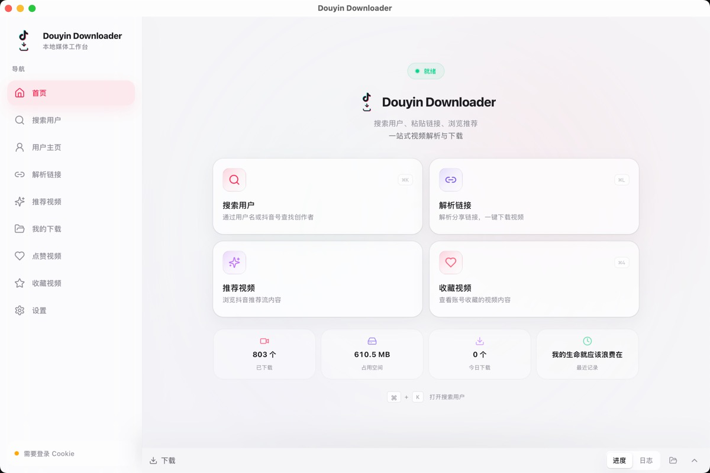
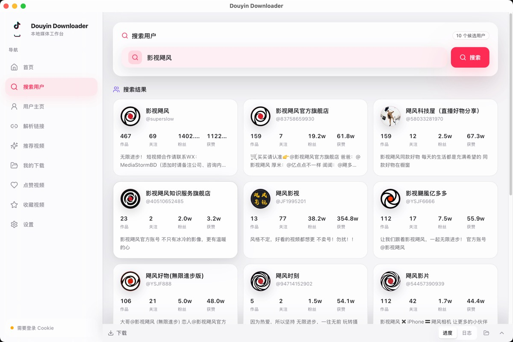
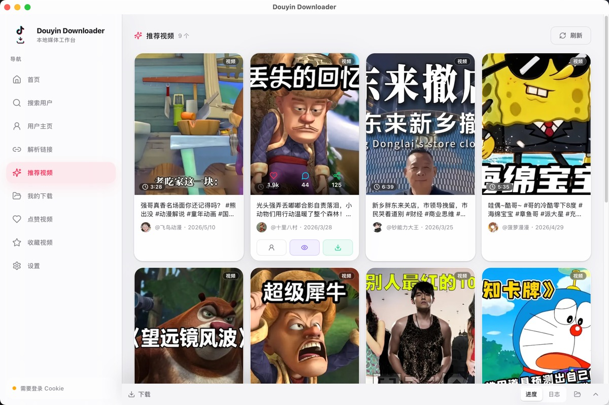
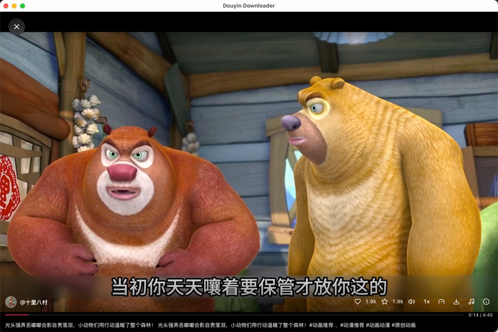

<div align="center">


# 💎 DY Video Downloader

### 抖音桌面级下载与内容归档工具 · Flask 控制台版

<p align="center">
  <a href="README.md">简体中文</a> | <a href="README_EN.md">English</a>
</p>

<p align="center">
  面向抖音 Web 端的轻量级资源解析与本地归档桌面终端。提供 pywebview 原生窗口与本地 Web 双控台支持。
</p>

<p align="center">
  <a href="https://www.python.org/">
    
  </a>
  <a href="https://github.com/anYuJia/DY_video_downloader/releases/latest">
    
  </a>
  <a href="LICENSE">
    
  </a>
</p>

<h4>
  🚀 <a href="https://github.com/anYuJia/DY_video_downloader/releases/latest"><b>立即下载发行版</b></a>
  &nbsp;•&nbsp;
  🎨 <a href="#界面预览"><b>界面预览</b></a>
  &nbsp;•&nbsp;
  ⚡ <a href="#-核心技术优势与设计亮点"><b>技术优势</b></a>
  &nbsp;•&nbsp;
  🛠️ <a href="#快速开始"><b>快速开始</b></a>
  &nbsp;•&nbsp;
  💬 <a href="#常见问题"><b>常见问题</b></a>
</h4>

---

### 🌟 为什么值得点赞收藏？ (Why Star Us?)

> **💡 如果您觉得本项目对您有帮助，请右上角点个 Star 🌟，您的鼓励是作者持续维护与优化底层引擎的最大动力！**
> 
> * **极其丰富的功能**：整合了用户检索、单链接解析、下载质量管理、批量异步队列下载与本地多媒体归档库。
> * **安全本地存储**：防目录穿越越权保护静态多媒体代理服务，所有的隐私和 Cookie 全部离线保存在本地。
> * **极致去重性能**：搭载全新的 $O(1)$ 内存 Set 求交集去重算法，极速校验已下载文件，释放 100% 磁盘开销。
> * **多端桥接能力**：自适应无缝退化与 IPC 桥接机制，不管是打包的原生应用还是作为本地局域网服务运行都游刃有余。

</div>

---

## ⚡ 核心技术优势与设计亮点

本项目拥有多项精心设计的工业级技术优化，为您提供坚如磐石的系统性能和丝滑的使用体验：

### 1. 🚀 极致性能：单次扫描与 $O(1)$ 内存去重引擎
* **去重瓶颈消除**：彻底废弃了在去重时反复对整个下载目录进行 `os.walk` 遍历的旧设计（时间复杂度高达 $O(N \times \text{walk})$）。
* **Set 求交集算法**：重构为 **单次懒加载磁盘遍历**。启动时一次性扫描目录，使用高效的正则表达式 `re.findall(r'[A-Za-z0-9]{6,}', filename)` 提取已有文件特征 Token。之后的所有校验全部通过内存集合交集（`records & file_ids`）完成。
* **物理耗时暴降**：磁盘扫描频次由 $N+1$ 次**减少为 1 次**。在万级下载量下，去重效率从数分钟**暴降至毫秒级**，磁盘读写利用率瞬间归零。

### 2. 🌪️ 界面防死锁：高频 Socket.IO 进度节流
* 批量下载在跳过大量已下载视频时，后端通过 **步长计数机制** 对进度事件派发实施了**节流（Throttling）限制**，避免了前端 Webview 遭遇高频 `download_progress` 事件带来的 **重绘风暴（Repaint Storm）**，保证海量跳过时界面绝对不卡死。

### 3. 🎭 双端自适应：动态 IPC 与 Socket.IO 桥接
* 前端通过检测 `window.__TAURI__` 自动采用原生 Tauri 高效 IPC 管道或退化至本 Flask 后端的 Socket.IO 双向通信。
* 本地文件静态托管接口配备了严密的安全防范，拦截 Path Traversal（路径穿越越权读取），保证数据安全。

---

## 🌟 核心能力矩阵

<div align="center">

| 🏷️ 模块能力 | 🛠️ 具体说明 | 🎯 核心技术实现 |
| :--- | :--- | :--- |
| **用户检索** | 搜索用户独立成页，支持输入补全、分页展示与检索历史清除。 | 全局上下文环境保留，切换无感知 |
| **单条解析** | 单链解析页提供键盘上下键智能选择及历史记录补全。 | 支持多媒体、Live Photo 与图集自动解析 |
| **批量下载** | 极速拉取作者全部作品、点赞及收藏，协程并发下载。 | 并发度、存放路径、文件命名模板动态自定义 |
| **沉浸播放** | 推荐 Feed 流去重加载，支持滚轮沉浸切换、作者一键跳转。 | 弱网自动探测，更精确的重试与加载提示 |
| **本地管理** | 支持“文件模式/作品模式”双向切换，全量搜索及物理定位。 | 配备防目录穿越安全过滤的静态多媒体文件服务 |
| **登录态保障** | 内置安全的浏览器登录外壳，支持浏览器 Cookie 动态提取。 | browser-cookie3 本地解密读取，零隐私泄露 |

</div>

---

## 界面预览

<p align="center">
  <strong>主界面</strong>
  <br>
  
</p>

<p align="center">
  <strong>搜索用户</strong>
  <br>
  
</p>

<p align="center">
  <strong>用户主页 / 批量下载</strong>
  <br>
  
</p>

<p align="center">
  <strong>推荐视频流</strong>
  <br>
  
</p>

<p align="center">
  <strong>沉浸式播放器</strong>
  <br>
  
</p>

## 快速开始

### 方式一：下载发行版

从 [Releases](../../releases/latest) 下载对应平台的安装包或压缩包，解压后运行即可。

当前发行产物大致包括：

- macOS：`.app` 和 `.dmg`
- Windows：便携版 `.zip` 和安装版 `.exe`
- Linux：`.tar.gz`

发行版会自动启动本地服务并打开桌面窗口。

macOS 如果提示“无法验证开发者”，可在终端执行：

```bash
sudo xattr -rd com.apple.quarantine /path/to/douyin_downloader.app
```

### 方式二：源码运行

```bash
git clone https://github.com/anYuJia/DY_video_downloader.git
cd DY_video_downloader

python -m venv .venv
source .venv/bin/activate  # Windows: .venv\Scripts\activate

pip install -r requirements.txt

cd frontend
npm install
npm run build
cd ..
```

#### 桌面模式

```bash
python main.py
```

说明：

- 会启动本地 Flask + Socket.IO 服务。
- 会自动选择 `5001` 到 `5010` 间的空闲端口。
- 会打开 pywebview 原生窗口，而不是普通浏览器标签页。

#### 浏览器 / 无界面模式

```bash
python -m src.web.web_app
```

说明：

- 默认监听 `127.0.0.1:5001`。
- 可通过环境变量调整监听地址和端口：

```bash
HOST=127.0.0.1 PORT=5001 python -m src.web.web_app
```

#### Cookie 获取方式

当前支持 3 种方式：

- 内置登录窗口
- 从本机浏览器读取 Cookie
- 手动粘贴 Cookie

## 使用流程

1. 启动应用并在设置中配置 Cookie 和下载目录。
2. 通过浏览器登录、浏览器 Cookie 读取或手动粘贴方式完成 Cookie 配置。
3. 使用搜索用户页检索目标用户，或通过解析链接页打开单条作品。
4. 从用户作品、单条详情、推荐视频、收藏视频、点赞视频或点赞作者入口发起下载任务。
5. 在底部任务面板查看实时进度，并在“我的下载”中切换文件模式/作品模式管理本地内容。

## 配置说明

应用会在程序执行目录下生成 `config.json`。当前主要字段：

| 字段 | 说明 |
|:---|:---|
| `cookie` | 抖音 Cookie。未配置时，部分接口不可用 |
| `base_dir` | 当前下载目录 |
| `history_dirs` | 历史下载目录列表，用于统一展示已下载文件 |

常用环境变量：

| 环境变量 | 作用 |
|:---|:---|
| `DOUYIN_COOKIE` | 启动时注入 Cookie |
| `DOUYIN_BASE_DIR` | 指定下载根目录 |
| `HOST` | 浏览器 / 无界面模式下的监听地址 |
| `PORT` | 浏览器 / 无界面模式下的监听端口 |
| `DEBUG_MODE=true` | 开启更详细的后端与 Socket.IO 日志 |

## 技术栈

| 模块 | 技术 |
|:---|:---|
| 桌面容器 | pywebview |
| Web 服务 | Flask, Flask-SocketIO |
| 并发下载 | asyncio, aiohttp, requests |
| 浏览器能力 | pywebview, browser-cookie3 |
| 前端界面 | React, Vite, TypeScript, Tailwind CSS |
| 打包分发 | PyInstaller |

## 项目结构

```text
.
├── main.py                  # 桌面入口与子进程分发
├── src/
│   ├── api/                 # 抖音接口、签名、Cookie 与浏览器回退
│   ├── config/              # 配置加载、保存与资源路径
│   ├── downloader/          # 媒体下载、进度回调与去重记录
│   ├── user/                # 用户检索、作品列表与内容解析
│   ├── utils/               # 通用工具
│   └── web/                 # Flask 路由、Socket.IO 与 React 构建产物
├── frontend/                # React/Vite 前端源码
├── lib/js/                  # Web 端签名脚本
├── scripts/                 # 安装器与辅助脚本
├── icons/                   # 应用图标资源
└── img/                     # README 展示图片
```

## 常见问题

### Cookie 失效或无法获取作品怎么办

抖音 Web 端 Cookie 有时效性，也可能受账号状态、风控或接口变动影响。建议重新登录获取 Cookie，并确认当前账号在浏览器中可以正常访问目标内容。

### 下载速度慢或失败怎么办

速度受网络、资源可用性和平台响应影响。可以尝试更换网络、减少并发任务、重新获取 Cookie，或稍后重试。

### 为什么下载质量切换后看起来大小一样

部分作品本身只返回一种可下载媒体地址，或不同清晰度地址经过平台转码后体积接近。质量策略会优先选择对应候选地址，但最终是否存在多个有效质量取决于平台接口返回。

### 为什么已下载作品会被跳过

项目会在作者目录下维护下载记录，以避免重复下载同一作品。如果你移动了文件或手动修改了下载目录，请在“我的下载”中确认当前目录配置。

### Linux 服务器能不能跑

可以。更适合使用浏览器 / 无界面模式，而不是桌面模式；如果需要远程访问，请自行处理反向代理、访问控制和 Cookie 暴露风险。

## 相关项目

[Rust 重构版](https://github.com/anYuJia/douyin-downloader-rust)：更小体积、更高性能的实现方向。

## 免责声明

本项目仅供个人学习、研究和内容备份使用。使用者应自行确认下载行为符合相关法律法规、平台服务条款和内容版权要求。任何因不当使用、商业采集、批量爬取或侵犯第三方权益导致的后果，均由使用者自行承担。

---

<p align="center">如果这个项目对你有帮助，欢迎 Star 支持。</p>

<p align="center">
  <a href="https://star-history.com/#anYuJia/DY_video_downloader&Date">
    
  </a>
</p>
