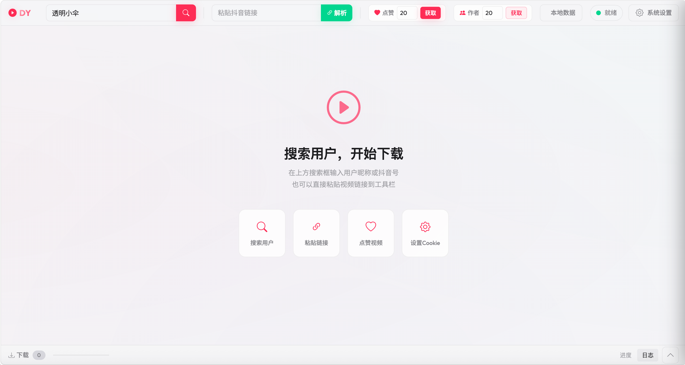
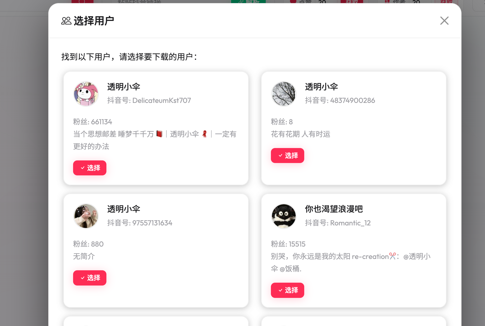
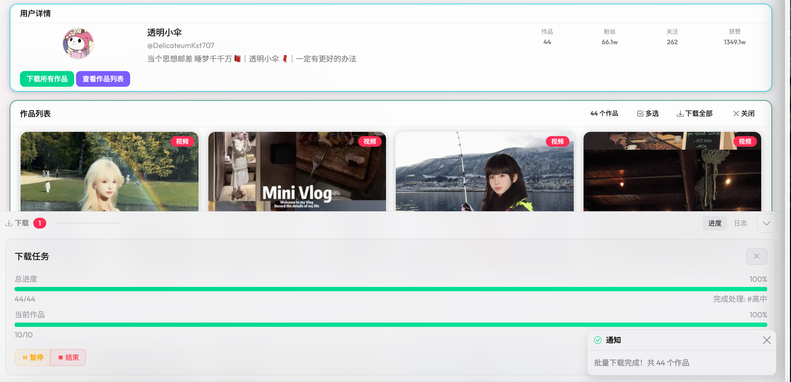

<div align="center">

**简体中文** | [English](README_EN.md)

# 🎥 DY Video Downloader

**新一代智能化、高性能的抖音多媒体资源抓取与管理平台**

[](https://www.python.org/)
[](LICENSE)
[]()
[]()

[功能概览](#-功能概览) • [快速体验](#-快速体验) • [系统配置](#-系统配置) • [操作指南](#-操作指南) • [常见问题](#-常见问题)

</div>

<br/>

**DY Video Downloader** 专为需要快速、稳定、海量获取抖音平台资源的创作者和数字营销人员打造。它突破了传统的命令行限制，提供了现代化且极具交互性的 Web 控制台，基于高效的异步架构与智能指纹校验机制，为您提供企业级的数据同步与数字资产管理体验。

---

## ✨ 核心优势

我们通过底层架构优化与交互层重新设计，为您提供了一整套“零配置开箱即用”的高级特性：

| 🎯 智能资源检索 | 🚀 极致下载性能 |
| :--- | :--- |
| **多维度解析**: 支持用户昵称、抖音号、个人主页链接全景检索。 <br> **动态抓取**: 自动处理滑块与反爬机制，深度挖掘目标作品数据。 <br> **全品类支持**: 无缝适配常规视频、图文合集、甚至 Live Photo 格式。 | **高并发引擎**: 底层采用 AsyncIO，释放网络吞吐极限，跑满带宽。 <br> **断点续传**: 智能分片与网络异常恢复，无惧数GB量级巨型任务。 <br> **精准去重**: 引入指纹对比与本地哈希缓存，同一视频绝不二次下载。 |

| 🌐 现代化可视面板 | 💼 企业级存储策略 |
| :--- | :--- |
| **全双工通信**: WebSocket 毫秒级任务状态推流，掌控每一个分片下载进度。<br> **响应式交互**: 桌面/平板自适应，支持拖拽识别、一键多选操作。 | **分级归档**: 根据目标博主建立多级独立目录，作品按时间戳/名称规范化存放。<br> **统一任务管理**: 控制台内嵌完整任务生命周期管理（暂停/恢复/终止/重试）。 |

---

## 📸 终端预览

直观的沉浸式管理界面，大幅降低您的学习成本。

> **控制台大盘 (Dashboard)**
> 
> 提供全局的数据掌控，包含实时的连接状态、目标用户解析入口与当前配置纵览。


> **深度检索与画像分析**
> 
> 输入博主链接，一键获取包含隐藏无水印作品在内的全量投稿列表。


> **全景下载监控中心**
> 
> 下载进程可视化分析，当前实时网速、预计剩余时间、异常日志一目了然。


---

## 🚀 快速体验

我们为您提供了 **独立运行包** 与 **源码部署** 两种方式。

### A. 零配置免环境使用 (推荐)
如果您不想配置 Python 环境，可以直接在 GitHub Releases 下载对应平台的发布包：

👉 **[下载最新 MacOS ARM64 运行包 (v1.0.0)](../../releases/latest)**

解压并运行 `douyin_downloader` 即可。

### B. 开发者源码部署
如果您是开发者或需要自定义，请使用：
```bash
# 克隆仓库
git clone https://github.com/anYuJia/DY_video_downloader.git
cd DY_video_downloader

# 创建并激活虚拟环境 (可选)
python3 -m venv .venv
source .venv/bin/activate  # macOS/Linux
# .venv\Scripts\activate   # Windows

# 安装核心依赖矩阵
pip install -r requirements.txt
```

### 2. 启动后台守护进程
环境准备就绪后，直接启动服务，系统会自动生成默认依赖与配置。

```bash
python main.py
```

### 3. 访问可视控制台并自动化配置
> 🎉 **启动成功！** 浏览器打开 [http://localhost:5001](http://localhost:5001)，系统首屏将自动引导您完成身份验证和 Cookie 抓取，**无需您手动编辑任何本地配置文件**。

---

## ⚙️ 系统配置

尽管系统具备极高的自动化体验，但高级用户依然可以通过修改运行后在根目录生成的 `config.json` 来深度定制本地运行参数：

| 参数名称 | 规格及说明 | 默认值 |
| :--- | :--- | :--- |
| `cookie` | 授权身份识别码。**系统会在通过 Web UI 登录时自动接管并填充此项，一般情况下无需手动干预。** | `""` |
| `base_dir` | 媒体资源落盘基础路径，支持相对/绝对路径 | `"./douyin_download"` |
| `chunk_size` | TCP流下载分片阈值 (Bytes)，提升或降低此值可均衡内存占用与IO性能 | `1048576` (1MB) |

---

## 🎯 操作指南

**批量获取主播历史作品**
1. 访问左侧导航栏的 **作品检索** 选项页。
2. 支持传入三种格式的目标定位符：`抖音昵称 (e.g. 罗永浩)`、`抖音号 (e.g. luoyonghao)` 或 `用户主页完整URL`。
3. 引擎将自动爬取该用户所有数据，您可通过前端复选框进行精准过滤，然后点击“添加至下载队列”。

---

## 🔧 常见排错指示 (Troubleshooting)

- **Q: 检索用户时频发失败 / 提示“签名异常”？**
  - **A**: 通常是传入配置的 Cookie 已失效或风控过期。请回到网页版重新执行扫码验证，并使用最新 Cookie 覆盖重启。
- **Q: 日志显示无法启动 Web Socket，下载进度卡置为 0%？**
  - **A**: 确认 5001 端口是否被其他进程（如 MacOS 原生控制中心服务）抢占。您可尝试修改 `main.py` 底部端口配置重新映射。
- **Q: 系统可以无界面在 Linux 服务器跑吗？**
  - **A**: 完全可以，本系统 Web UI 前后端完全解耦，服务端完全基于 Python 原生库编写，适合部署在 CentOS/Ubuntu 等无桌面系统，通过外网 IP + 端口远程访问控制台即可。

---

## ⚖️ 合规与免责声明

本数字工具的发布与分享仅用于学术探索与技术交流。
1. 请勿突破目标平台的风控速率进行恶意高频请求；
2. 抓取的本地化媒体内容严禁用于二次分发、包装或商业盈利；
3. **因滥用本项目所致的账号封禁、法务纠纷等一切后果，项目的贡献者不承担任何连带责任。**

<br/>
<div align="center">
  如果 <b>DY Video Downloader</b> 为您的工作流带来了效率提升，请不要吝啬您的 ⭐ <b>Star</b>。
  <br><br>
  
  [提出缺陷（Issues）](../../issues) • [发起新特性（PR）](../../pulls)
</div>

