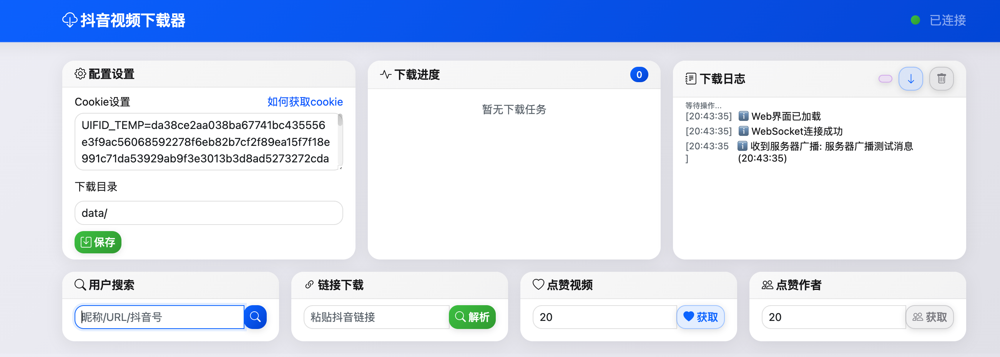
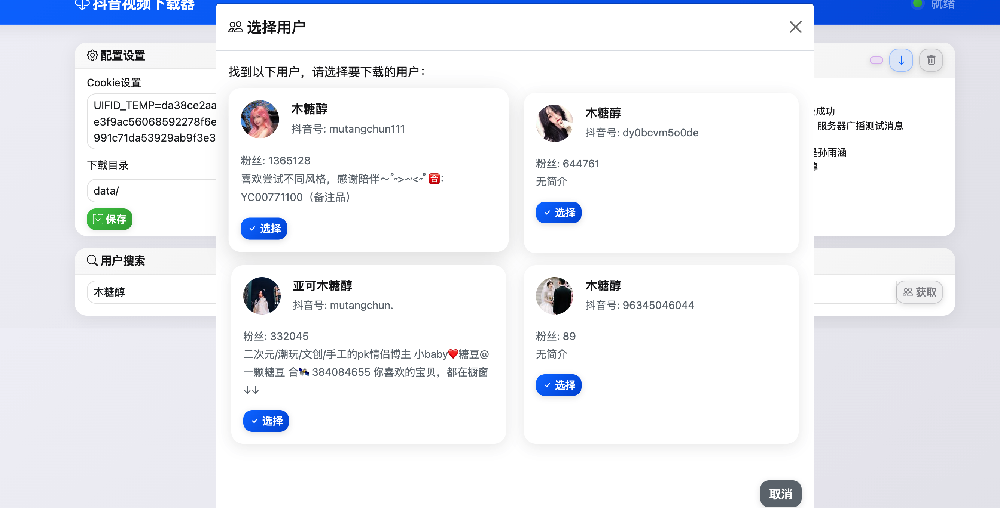
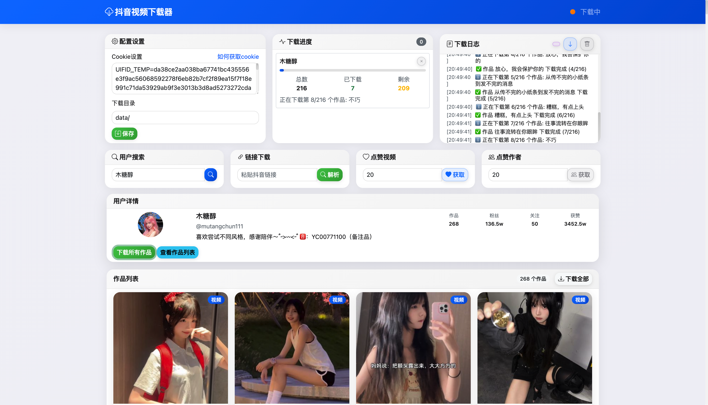

<div align="center">

# 🎵 DY Video Downloader

**一个功能强大的抖音视频下载器**

[](https://www.python.org/downloads/)
[](LICENSE)
[](#)
[](#)
[](#)

[功能特点](#-功能特点) • [快速开始](#-快速开始) • [配置说明](#-配置说明) • [使用方法](#-使用方法) • [项目结构](#-项目结构)

</div>

---

## 📖 简介

DY Video Downloader 是一个专为抖音平台设计的多媒体下载工具。它提供了现代化的 Web 界面，支持批量下载用户作品、点赞视频等功能，并具备智能去重、断点续传等高级特性。

## ✨ 功能特点

### 🎯 核心功能
- **多种搜索方式**: 支持昵称、抖音号、主页链接三种搜索方式
- **批量下载**: 一键下载用户的所有视频作品
- **点赞下载**: 下载自己点赞的视频和点赞作者的全部作品
- **多媒体支持**: 支持视频、图片、Live Photo 等多种格式

### 🚀 高级特性
- **智能去重**: 自动跳过已下载的内容，避免重复下载
- **分类存储**: 按用户自动创建文件夹，井然有序
- **异步下载**: 高效的异步下载机制，提升下载速度
- **断点续传**: 支持下载中断后继续下载
- **进度监控**: 实时显示下载进度和状态

### 🌐 Web 界面
- **现代化设计**: 响应式界面，支持多设备访问
- **实时通信**: WebSocket 实时更新下载状态
- **拖拽支持**: 支持拖拽和粘贴链接
- **任务管理**: 完整的下载任务管理系统

## 🛠 环境要求

- **Python**: 3.7 或更高版本
- **操作系统**: Windows / macOS / Linux
- **浏览器**: Chrome / Firefox / Safari / Edge
- **Node.js**: 用于执行JavaScript签名算法（可选，内置PyExecJS）

## 🚀 快速开始

### 1️⃣ 克隆项目

```bash
git clone https://github.com/anYuJia/DY_video_downloader.git
cd DY_video_downloader
```

### 2️⃣ 安装依赖

```bash
pip install -r requirements.txt
```

### 3️⃣ 配置应用

编辑项目根目录的 `config.json` 文件：

```json
{
  "cookie": "your_douyin_cookie_here",
  "base_dir": "./douyin_download"
}
```

### 4️⃣ 启动应用

```bash
python main.py
```

### 5️⃣ 访问 Web 界面

在浏览器中打开：**http://localhost:5001**

> 💡 首次运行会启动配置向导，按照提示完成配置即可。

## ⚙️ 配置说明

### 📝 配置文件详解

项目支持通过 `config.json` 文件进行详细配置：

```json
{
  "cookie": "",                    // 抖音Cookie（必填）
  "base_dir": "./douyin_download"  // 下载目录
}
```

**Cookie 示例：**
```
ttwid=1%7C...; passport_csrf_token=...; d_ticket=...; ...
```

## 📸 界面预览

### 🏠 主界面


### 👤 用户搜索


### 💖 点赞视频


### 👥 点赞作者


### 📥 下载进度


## 📋 使用方法

本工具采用 **Web 界面操作**，无需复杂的命令行操作，简单易用。

### 🔍 搜索用户

在 Web 界面中支持三种搜索方式：

| 搜索方式 | 示例 | 说明 |
|---------|------|------|
| 用户昵称 | `何柚可` | 输入用户的显示昵称 |
| 抖音号 | `snbb0616` | 输入用户的抖音号 |
| 主页链接 | `https://www.douyin.com/user/...` | 完整的用户主页URL |

### 📥 下载操作

通过 Web 界面进行下载操作：

- **批量选择**: 在界面中勾选要下载的作品
- **一键下载**: 点击下载按钮开始批量下载
- **实时监控**: 在界面中查看下载进度和状态
- **任务管理**: 可以暂停、恢复或取消下载任务

### 💖 点赞功能

- **下载点赞视频**: 下载您在抖音上点赞过的视频
- **下载点赞作者作品**: 下载您点赞过的视频作者的所有作品

## 📁 项目结构

```
DY_video_downloader/
├── 📄 main.py                 # 程序入口
├── 📄 launcher.py             # 启动器
├── 📄 requirements.txt        # 依赖列表
├── 📄 config.json            # 配置文件
├── 📄 setup.py               # 安装脚本
├── 📄 __init__.py            # 包初始化
├── 📁 src/                   # 源代码
│   ├── 📁 api/               # API 模块
│   │   ├── 📄 __init__.py
│   │   └── 📄 api.py         # 抖音 API 实现
│   ├── 📁 config/            # 配置模块
│   │   ├── 📄 __init__.py
│   │   └── 📄 config.py      # 配置管理
│   ├── 📁 downloader/        # 下载模块
│   │   ├── 📄 __init__.py
│   │   └── 📄 downloader.py  # 下载器实现
│   ├── 📁 user/              # 用户模块
│   │   ├── 📄 __init__.py
│   │   └── 📄 user_manager.py # 用户管理
│   └── 📁 web/               # Web 界面
│       ├── 📄 __init__.py
│       ├── 📄 web_app.py     # Flask 应用
│       ├── 📁 static/        # 静态资源
│       └── 📁 templates/     # HTML 模板
├── 📁 lib/                   # 第三方库
│   └── 📁 js/
│       └── 📄 douyin.js      # 签名生成脚本
├── 📁 img/                   # 项目截图
└── 📁 douyin_download/       # 下载文件存储目录
```

## 🔧 技术栈

- **后端**: Python 3.7+, Flask, AsyncIO
- **前端**: HTML5, CSS3, JavaScript, WebSocket
- **网络**: Requests, AioHTTP
- **JavaScript执行**: PyExecJS
- **实时通信**: python-socketio
- **数据处理**: JSON, Base64

## 📊 功能支持

| 功能 | 支持格式 | 状态 |
|------|----------|------|
| 视频下载 | MP4 | ✅ |
| 图片下载 | JPG, PNG | ✅ |
| Live Photo | MP4 | ✅ |
| 批量下载 | 所有格式 | ✅ |
| 断点续传 | 所有格式 | ✅ |
| 异步下载 | 所有格式 | ✅ |
| 智能去重 | 所有格式 | ✅ |
| 进度监控 | 实时显示 | ✅ |

## 🔧 常见问题

### Q: Cookie 失效怎么办？
A: 重新登录抖音网页版，按照上述步骤重新获取 Cookie 并更新配置文件。

### Q: 下载速度慢怎么办？
A: 可以调整 `config.json` 中的 `chunk_size` 参数，或检查网络连接。

### Q: 无法访问 Web 界面？
A: 检查端口是否被占用，默认端口为5001。如需修改端口，可以通过环境变量PORT设置。

### Q: 下载的文件在哪里？
A: 默认在项目目录的 `douyin_download` 文件夹中，可通过配置文件修改。

## ⚠️ 注意事项

- 🔒 请遵守抖音的使用规则，不要滥用下载功能
- 📝 请不要对他人的作品进行未经授权的复制或修改
- 💼 请不要将下载的作品用于商业目的
- 🔄 建议定期更新 Cookie 以确保功能正常
- ⚡ 下载采用异步机制，但为保护服务器，不支持高并发下载
- 🛡️ 请确保在安全的网络环境中使用，保护个人隐私

## 🤝 贡献指南

欢迎提交 Issue 和 Pull Request！

1. Fork 本项目
2. 创建特性分支 (`git checkout -b feature/AmazingFeature`)
3. 提交更改 (`git commit -m 'Add some AmazingFeature'`)
4. 推送到分支 (`git push origin feature/AmazingFeature`)
5. 打开 Pull Request

## 📄 许可证

本项目采用 MIT 许可证 - 查看 [LICENSE](LICENSE) 文件了解详情。

## ⚖️ 免责声明

本工具仅用于学习和研究目的，请在合法合规的范围内使用。作者不对因使用本工具而导致的任何法律问题承担责任。

---

<div align="center">

**如果这个项目对您有帮助，请给它一个 ⭐️**

[报告问题](../../issues) • [功能请求](../../issues) • [贡献代码](../../pulls)

</div>

